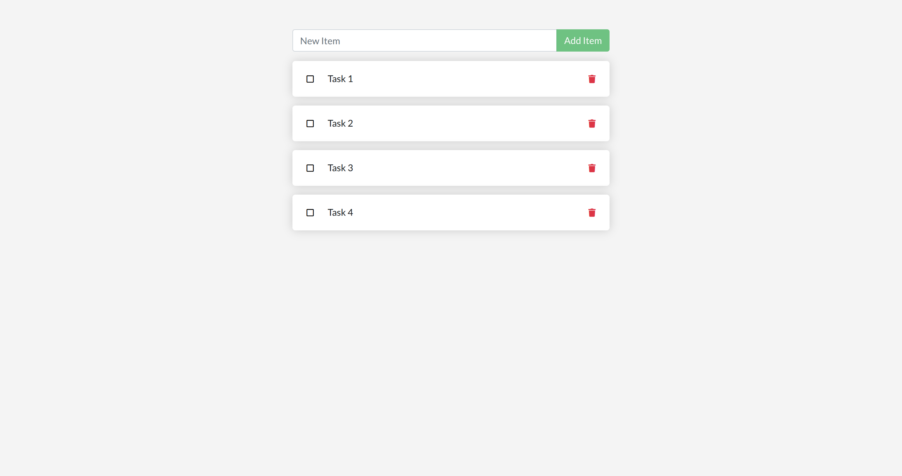

# My Todo App — Docker Compose Assignment

**Objective:** Build and manage a simple multi-service To‑Do app using Docker and Docker Compose (frontend + Postgres DB).

---

## What I did
- Created/updated `Dockerfile` for the frontend and added `docker-compose.yml` defining `frontend` and `db` (Postgres) with a named volume `postgres_data` for persistence.
- Verified the frontend is accessible (mapped to host port `8000`) and that both containers run with `docker-compose up -d`.

---

## Preview

---

## Commands used
- `docker-compose build` — Build the frontend image from the Dockerfile.
- `docker-compose up -d` — Start frontend and db services in detached mode.
- `docker ps` — List running containers.
- `docker run` — Run a container from an image (used to run built images locally).
- `docker stop` — Stop a running container.
- `docker rm` — Remove a stopped container.
- `docker images` — List all local images.
- `docker rmi` — Remove a local image.
- `docker logs` — View logs of a container.
- `docker-compose logs -f frontend` — Follow frontend logs.
- `docker-compose exec frontend bash` — Open a shell inside the frontend container.
- `docker inspect <container_name>` — Inspect container details (network, mounts, etc.).
- `docker-compose down` — Stop and remove services started by Compose.
- `docker image prune -f` — Remove dangling images.
- `docker system prune -f` — Clean up unused Docker resources.
- `curl http://localhost:8000` — Verify the frontend is serving the app.

---

## What I learned
- How to write a `Dockerfile` for a frontend, define services in `docker-compose.yml`, use named volumes for Postgres persistence, and verify/inspect running containers.
